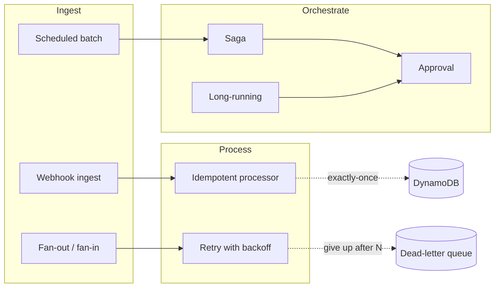
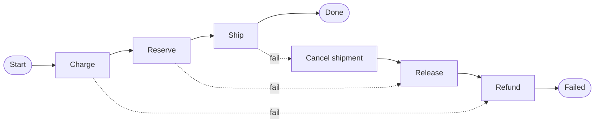
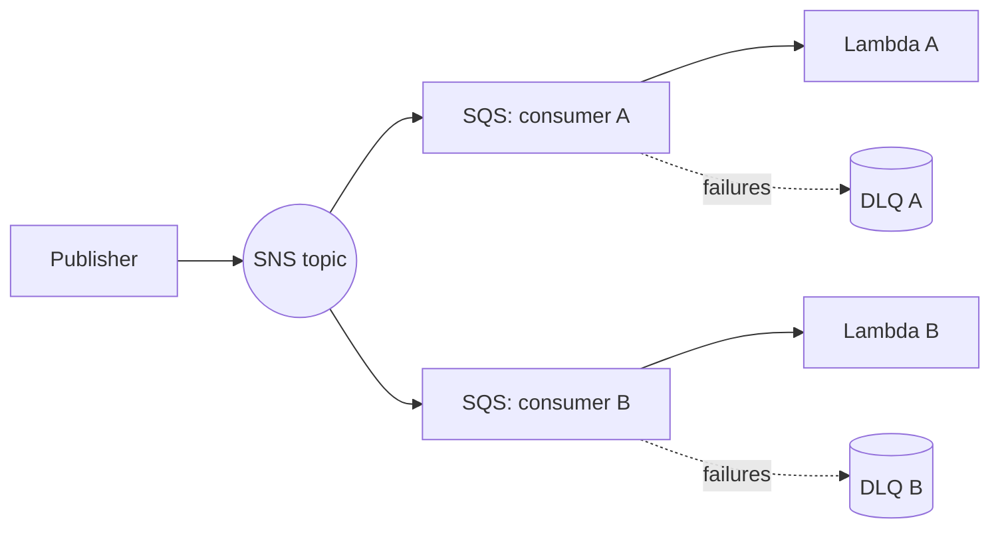
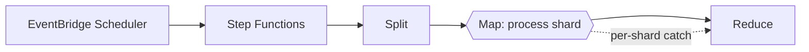
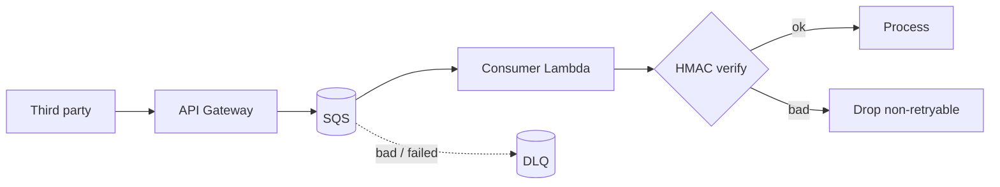
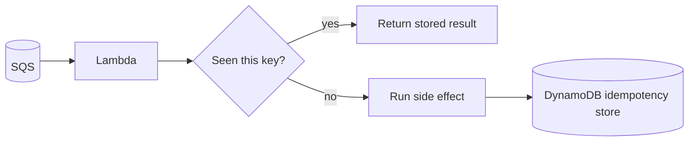
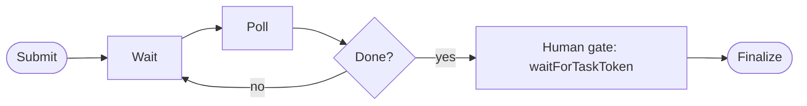
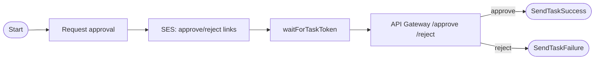
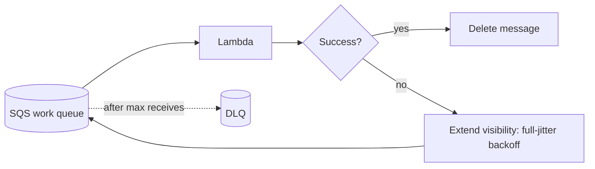

# aws-serverless-patterns

[](https://github.com/shivajichaprana/aws-serverless-patterns/actions/workflows/ci.yml)
[](LICENSE)
[](https://developer.hashicorp.com/terraform)

Reusable, production-minded **AWS Step Functions + Lambda** patterns packaged as
self-contained Terraform modules. Each pattern lives under `patterns/` and can be
deployed on its own or composed into a larger event-driven system.

The aim is to provide battle-tested starting points for the orchestration problems
that recur in serverless architectures — distributed transactions, fan-out
processing, scheduled batch jobs, webhook ingestion, idempotency, long-running and
human-in-the-loop workflows, and resilient retries — rather than re-deriving them
on every project. All eight patterns are deployable today, carry unit tests for
their Lambda handlers, and are validated in CI.

## Pattern catalogue

| Pattern | When to reach for it | Key trade-offs | Core services |
|---|---|---|---|
| [Saga](patterns/saga/) | A business action spans several services and there is no distributed transaction to lean on, so partial failure must be unwound explicitly. | Compensations are eventually consistent and you must design a reverse action for every forward step. | Step Functions, Lambda, DynamoDB |
| [Fan-out / fan-in](patterns/fan-out/) | One event must reach many independent consumers, each able to fail and retry on its own. | More moving parts (a queue + DLQ per consumer); ordering is not preserved across consumers. | SNS, SQS, Lambda |
| [Scheduled batch](patterns/scheduled-batch/) | Work is time-driven (nightly rollups, periodic syncs) and should run with bounded, observable concurrency. | Not for low-latency reactions; a missed window waits for the next tick unless you backfill. | EventBridge Scheduler, Step Functions, Lambda |
| [Webhook ingest](patterns/webhook-ingest/) | A third party POSTs events you must accept durably and verify, decoupling intake from processing. | Signature schemes differ per provider; the consumer must be idempotent because delivery is at-least-once. | API Gateway, SQS, Lambda |
| [Idempotent processor](patterns/idempotent-processor/) | At-least-once delivery would otherwise cause duplicate side effects (double charges, double emails). | Adds a DynamoDB lookup per invocation and a TTL window you must size to your retry horizon. | Lambda Powertools, DynamoDB |
| [Long-running workflow](patterns/long-running/) | A workflow waits minutes to days on an external system without holding a Lambda open. | Standard Step Functions execution-history limits apply; polling cadence must be tuned to cost. | Step Functions (wait states), Lambda, DynamoDB |
| [Approval workflow](patterns/approval-workflow/) | A human must approve or reject before the workflow continues. | Requires a callback surface (email links + API) and a single-decision guard against duplicate clicks. | Step Functions (task tokens), SES, API Gateway |
| [Retry with backoff](patterns/retry-backoff/) | Downstream calls fail transiently and you want jittered backoff plus a dead-letter path after N attempts. | Backoff lengthens end-to-end latency; poison messages still need a DLQ drain strategy. | SQS, Lambda |

For a structured walk through choosing between these, see the
[pattern selection guide](docs/pattern-selection-guide.md).

## How the patterns fit together

The patterns are independent modules, but they compose along a common event-driven
spine: something ingests work, something orchestrates it, and durable stores plus
dead-letter paths keep failures recoverable.



## Pattern architectures

<details>
<summary><strong>Saga — compensating transactions</strong></summary>



Each forward `Task` has a paired compensation; on failure the saga unwinds
completed steps in reverse order. State is tracked in DynamoDB.
</details>

<details>
<summary><strong>Fan-out / fan-in</strong></summary>



A single publish fans out to per-consumer queues, each with its own DLQ and an
optional SNS filter policy.
</details>

<details>
<summary><strong>Scheduled batch</strong></summary>



A schedule starts a state machine that splits the workload, processes shards
with a bounded `Map`, and reduces results.
</details>

<details>
<summary><strong>Webhook ingest</strong></summary>



API Gateway writes directly to SQS (no Lambda in the hot path); the consumer
verifies the signature in constant time before processing.
</details>

<details>
<summary><strong>Idempotent processor</strong></summary>



Powertools keys each message and records its result in DynamoDB with a TTL, so a
redelivery returns the prior outcome instead of repeating the work.
</details>

<details>
<summary><strong>Long-running workflow</strong></summary>



A wait/poll loop with exponential backoff and a poll-budget guard, ending in a
task-token sign-off gate. Job state lives in DynamoDB.
</details>

<details>
<summary><strong>Approval workflow</strong></summary>



The state machine pauses on a task token; an emailed link hits API Gateway, which
resumes or fails the execution under a single-decision guard.
</details>

<details>
<summary><strong>Retry with backoff</strong></summary>



On failure the handler computes a full-jitter exponential backoff from the SQS
receive count, extends the message's visibility timeout, and reports a partial
batch failure; SQS redrives to the DLQ after the max receive count.
</details>

## Repository layout

```
aws-serverless-patterns/
├── patterns/
│   ├── saga/                  # distributed transaction + compensations
│   ├── fan-out/               # SNS -> SQS -> Lambda fan-out
│   ├── scheduled-batch/       # EventBridge -> Step Functions batch
│   ├── webhook-ingest/        # API Gateway -> SQS -> Lambda
│   ├── idempotent-processor/  # exactly-once side effects
│   ├── long-running/          # wait-state workflows
│   ├── approval-workflow/     # task-token human approval
│   └── retry-backoff/         # retry / backoff / DLQ
├── tests/                     # moto-based unit tests for every Lambda handler
├── scripts/deploy-all.sh      # validate/plan/apply/destroy across all patterns
├── docs/                      # cross-pattern notes and selection guide
├── .github/workflows/ci.yml   # Terraform validate (matrix) + pytest
├── Makefile
├── CONTRIBUTING.md
├── LICENSE
└── README.md
```

## Prerequisites

- [Terraform](https://developer.hashicorp.com/terraform) >= 1.6
- AWS provider >= 5.40
- Python 3.12 (runtime for the Lambda handlers)
- An AWS account and credentials with permission to manage the services listed
  for the pattern you intend to deploy

## Using a pattern

Each pattern is a standalone Terraform root module. To deploy one:

```bash
cd patterns/saga
terraform init
terraform plan  -var 'name_prefix=demo'
terraform apply -var 'name_prefix=demo'
```

Or drive any pattern through the Makefile from the repo root:

```bash
make validate                 # terraform validate every pattern (no credentials)
make plan    PATTERN=saga     # plan a single pattern
make apply   PATTERN=saga     # apply a single pattern
make destroy PATTERN=saga     # tear it back down
```

Documentation uses the reserved placeholder account id `123456789012`; replace any
example inputs with the values for your own account (`<your-aws-account>`).

## Testing

The Lambda handlers are unit-tested with [moto](https://github.com/getmoto/moto)
so the suite runs offline with no AWS account:

```bash
make test-deps   # pip install -r tests/requirements.txt
make test        # python -m pytest -q
```

`tests/conftest.py` isolates each pattern's flat `src/` imports (several patterns
reuse file names like `store.py` and `handlers.py`), so the whole suite runs in a
single session without module collisions.

## Continuous integration

[`.github/workflows/ci.yml`](.github/workflows/ci.yml) runs on every push and pull
request and pins each action to a commit SHA:

- **terraform** — a matrix over all eight patterns runs `terraform fmt -check`,
  `terraform init -backend=false`, and `terraform validate` (no credentials needed).
- **python-tests** — installs the test requirements and runs `pytest` against the
  handler suite.

## Design principles

- **Least privilege.** IAM policies are scoped to specific ARNs derived from
  `aws_caller_identity`, `aws_partition`, and `aws_region` data sources — never `*`
  on resources where a concrete ARN is knowable.
- **Failure is a first-class path.** Every Step Functions `Task` defines `Retry`
  for transient faults and `Catch` for terminal handling; sagas always unwind
  completed work in reverse order; queues have dead-letter queues.
- **Observable by default.** State machines log to CloudWatch Logs, traces flow to
  X-Ray, and Lambda handlers emit structured logs suitable for querying.
- **No secrets in code.** Configuration comes from variables and environment;
  nothing sensitive is committed.

## License

Released under the MIT License — see [LICENSE](LICENSE).

## Security

Please report security issues privately via a
[GitHub Security Advisory](https://github.com/shivajichaprana/aws-serverless-patterns/security/advisories/new)
rather than opening a public issue.
