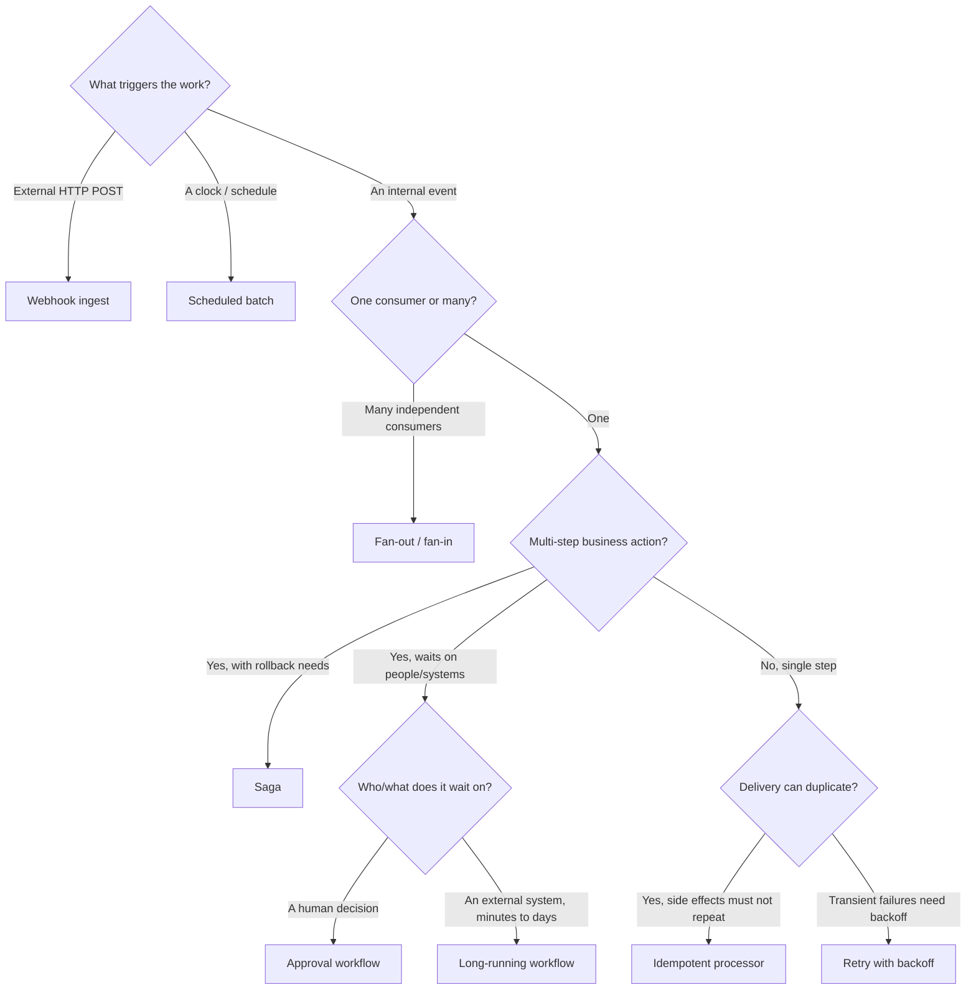

# Pattern selection guide

Eight patterns is enough that the first question — *which one do I actually need?* —
is worth answering deliberately. This guide moves from a quick decision tree to the
trade-offs that distinguish patterns people commonly confuse, and closes with a few
notes on composing them.

## Quick decision tree

The tree is a starting point, not a straitjacket — real systems chain several of
these together (see [Composing patterns](#composing-patterns)).

## Choosing by trigger

The cleanest first cut is *what starts the work*.

An **external HTTP caller** you do not control points to **webhook ingest**: accept
the request durably, verify its signature, and decouple intake from processing so a
slow consumer never causes the sender to time out and retry.

A **clock** points to **scheduled batch**: a cron-like schedule starts a state
machine that fans work across a bounded `Map` and reduces the results. Reach for it
for nightly rollups, periodic reconciliations, and housekeeping — not for anything
that must react within seconds.

An **internal event** is the interesting case, and the next question is how many
things must react to it.

## One consumer or many

If a single event must reach **several independent consumers** — each able to
succeed, fail, and retry on its own — use **fan-out / fan-in**. SNS handles the
fan, per-consumer SQS queues decouple the consumers, and each queue gets its own
dead-letter queue so one slow or broken consumer never blocks the others. Add an
SNS filter policy when a consumer only cares about a subset of messages.

If a single consumer handles the event, the question becomes whether the work is a
**multi-step business action** or a single step.

## Multi-step work: saga vs. long-running vs. approval

These three are all Step Functions orchestrations and are the most commonly
confused. They answer different questions.

**Saga** is about *atomicity without a transaction*. When an action touches several
services (charge a card, reserve inventory, schedule a shipment) and there is no
distributed transaction to roll them back together, the saga defines a compensating
action for every forward step and unwinds completed work in reverse order on
failure. Choose it when partial completion is unacceptable and each step has a
sensible undo.

**Long-running** is about *waiting cheaply*. When a workflow must wait on an
external system for minutes, hours, or days, you do not want a Lambda held open or
a thread parked. The wait-state pattern polls on an exponential-backoff cadence
with a poll budget, holding no compute between checks, and finishes with a
task-token gate. Choose it when the bottleneck is elapsed time on something you do
not control.

**Approval** is about *waiting on a person*. It is a specialisation of the
task-token idea where the token is handed to a human via an emailed link that calls
back through API Gateway. A single-decision guard prevents a double-click or a
race between the approve and reject links from resuming the execution twice. Choose
it whenever a human must explicitly approve or reject before the flow continues.

A useful one-liner: **saga** answers "how do I undo?", **long-running** answers
"how do I wait without paying for it?", and **approval** answers "how do I wait on
a human?".

## Single-step work: idempotent processor vs. retry-backoff

These two both live in the world of at-least-once delivery but solve opposite ends
of it.

**Idempotent processor** prevents *duplicate effects*. Because SQS, SNS, and
EventBridge all deliver at least once, the same message can arrive twice; if your
handler charges a card or sends an email, that is a real incident. Powertools keys
each message and records its result in DynamoDB with a TTL, so a redelivery returns
the stored outcome instead of repeating the side effect. Reach for it whenever a
duplicate would be harmful rather than merely wasteful.

**Retry with backoff** handles *transient failure*. When a downstream dependency
fails intermittently, immediate retries make things worse (a thundering herd). The
handler computes a full-jitter exponential backoff from the SQS receive count,
extends the message's visibility timeout, and reports a partial batch failure;
after the configured max receive count, SQS redrives the message to a DLQ for
inspection. Reach for it when failures are temporary and you want to spread retries
out rather than hammer a struggling dependency.

The two are complementary: a robust consumer is often *both* idempotent (so retries
are safe) *and* backed by backoff (so retries are gentle).

## Composing patterns

Patterns rarely ship alone. Common combinations:

- **Webhook ingest → idempotent processor.** The webhook layer guarantees durable,
  at-least-once delivery; the idempotent processor makes acting on that delivery
  safe. This is the canonical pairing for third-party event intake.
- **Fan-out → retry-backoff.** Fan a single event to several consumers, and let
  each consumer absorb transient downstream failures with jittered backoff and its
  own DLQ.
- **Scheduled batch → saga.** A nightly schedule kicks off a multi-step run whose
  steps must roll back cleanly if a later step fails.
- **Long-running / saga → approval.** A workflow reaches a point where a human must
  sign off; both the long-running and saga patterns end in a task-token gate that
  the approval pattern fills.

## Cross-cutting choices that apply to every pattern

- **Standard vs. Express Step Functions.** These patterns default to Standard
  workflows for durability and full execution history. Switch to Express only for
  high-volume, short-lived (<5 min), idempotent flows where per-execution history
  is not required.
- **Always wire a DLQ.** Every queue-backed pattern includes a dead-letter queue.
  Treat the DLQ depth as a first-class alarm, not an afterthought — a filling DLQ
  is the earliest honest signal that something downstream is broken.
- **Make consumers idempotent regardless.** At-least-once delivery is the default
  across SQS, SNS, and EventBridge. Even outside the idempotent-processor pattern,
  assume any message can arrive more than once.
- **Tune retention and TTLs to your retry horizon.** DLQ retention, idempotency-key
  TTLs, and poll budgets should all be sized against how long you are willing to
  keep retrying. Defaults are conservative; revisit them per workload.
